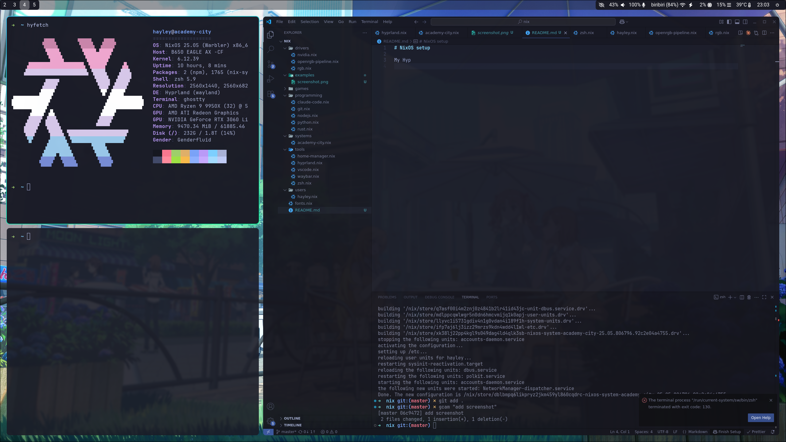

# NixOS Configuration

Personal NixOS configuration. I'm pretty new to NixOS, so this is probably all wrong on how it's set up.



## System Info

- NixOS
- Hyprland
- Waybar

## How to use

modify your /etc/nixos/configuration.nix to look like this:

```nix
{ config, pkgs, ... }:

{
  imports = [
    ./hardware-configuration.nix
    /home/hayley/Projects/nix/systems/academy-city.nix
  ];

  system.stateVersion = "25.05";
}
```
